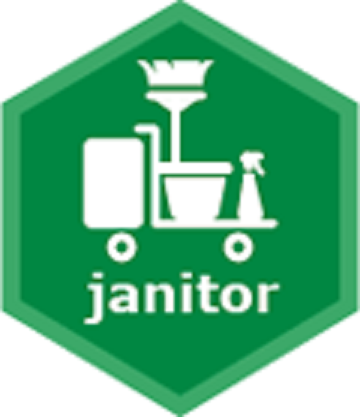

```{r setup, include = FALSE}
# Load packages required
library(knitr)
library(janitor)

knitr::opts_chunk$set(echo = TRUE)
```

## Setting a margin in RStudio

- It's possible to set a margin in RStudio, to give an indication of when code should be split over multiple lines


- To set the margin, go to Tools -> Global Options -> Code -> Display -> tick the 'Show margin' box


- It defaults to 80 characters, but that can be changed


## phiproject package

- [R projects](https://support.rstudio.com/hc/en-us/articles/200526207-Using-Projects) are a way of bundling together related files and scripts into a single folder

- Projects come with a `.Rproj` file, and wherever this is saved is where RStudio sets the working directory

- Using projects is recommended in [PHI's R style guide](https://github.com/Health-SocialCare-Scotland/R-Resources/blob/master/PHI%20R%20style%20guide.md)

- A project which follows the recommended structure can be created automatically using the [phiproject package](https://github.com/Health-SocialCare-Scotland/phiproject])


## janitor package

- [janitor](https://github.com/sfirke/janitor) provides a multitude of functions for 'cleaning' data

- It's specifically designed with beginner and intermediate R users in mind

- While not part of the [tidyverse](https://www.tidyverse.org/packages/), it's designed to work well with pipes

```{r, echo = FALSE, fig.align = 'center'}

```


## janitor::clean_names()

```{r}
names <- tibble::tibble(VAR_ONE = "ALL CAPS",
                        var.two = "dot",
                        VarThree = "No space",
                        `Var four` = "Space",
                        `% Var` = "symbol")
names
```


## janitor::clean_names()

```{r}
names <- tibble::tibble(VAR_ONE = "ALL CAPS",
                        var.two = "dot",
                        VarThree = "No space",
                        `Var four` = "Space",
                        `% Var` = "symbol")
names %>%
  janitor::clean_names()
```


## janitor::round_half_up()

- The base `round()` function rounds .5 up for odd numbers, and down for even numbers:

```{r}
x <- c(1.5, 2.5, 3.5, 4.5)
round(x)
```


## janitor::round_half_up()

- `janitor::round_half_up()` always rounds .5 up:

```{r}
x <- c(1.5, 2.5, 3.5, 4.5)
janitor::round_half_up(x)
```

- Using `janitor::round_half_up()` instead of `round()` is [recommended by SAG](https://www.isdscotland.org/About-ISD/Methodologies/_docs/Rounding-Methods-in-Different-Software_v1-0.pdf)